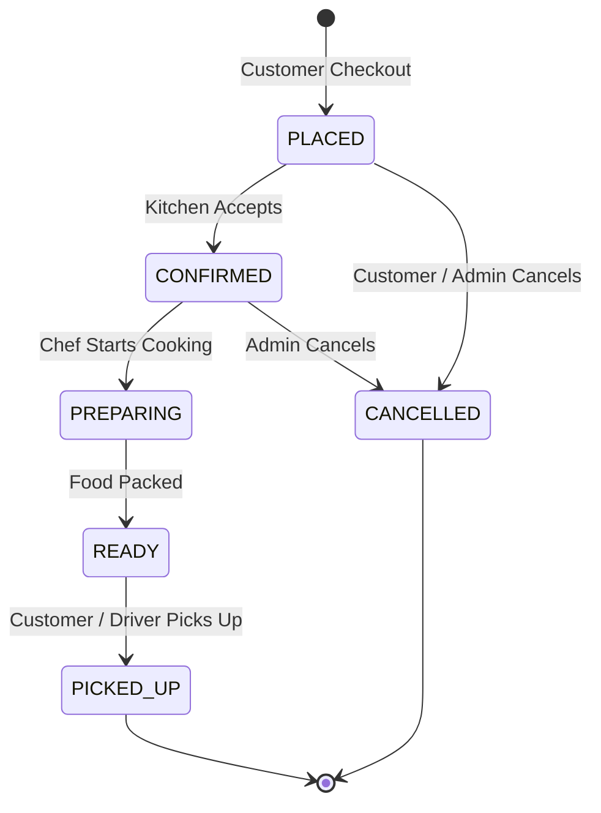

# CraveAI — Food Ordering System with AI-Powered Natural Language Menu Search
*Built for KPi-Tech Services Inc. — AI Software Engineer Assessment*


---

## 1. Project Overview & Problem Statement

Modern food ordering applications often force customers into rigid keyword lookups and nested filter dropdowns. **CraveAI** transforms the discovery experience with an **AI-Powered Natural Language Search Engine**. 

Instead of manually checking filters for vegetarian, spicy, and budget constraints, customers can type queries like:
- *"something spicy and vegetarian under 200 rupees"*
- *"a light lunch that is not fried"*
- *"high protein food"*
- *"something filling but not too expensive"*
- *"vegetarian food without dairy"*
- *"spicy chicken dishes below 300"*

### Core Engineering Philosophy: Deterministic Core + AI Enhancement
A fundamental pitfall in AI applications is allowing LLMs to directly control transactional business state (pricing, stock availability, order state transitions). CraveAI strictly isolates responsibilities:
- **AI Subsystem**: Query normalization, structured intent extraction, semantic relevance scoring, and human-friendly match explanations.
- **Deterministic Core**: Database hard constraint filtering, atomic checkout transactions, historical price snapshots, strict order state machine validation, and role-based access control.

---

## 2. System Architecture

```
+-------------------------------------------------------------------------------+
|                                Frontend (React + Vite)                        |
|   - Tailwind CSS + Lucide Icons + TanStack Query v5 + React Hook Form         |
|   - Customer UI: AI Natural Search Hero, Category Browser, Cart, Order Tracker|
|   - Admin UI: Metric Cards, Order Management Table, Menu Catalog Manager      |
+---------------------------------------+---------------------------------------+
                                        | (HTTP / REST + Bearer JWT)
                                        v
+-------------------------------------------------------------------------------+
|                               Backend (FastAPI)                               |
|  [Middleware]: Structured Request Logging, Latency Timing, CORS               |
|  [Auth/Security]: JWT Bearer Tokens, Passlib/Bcrypt, Role-based Guard         |
|                                       |                                       |
|  +-----------------------------+     +-------------------------------------+  |
|  |       API Route Layer       |     |        Core & Common Modules        |  |
|  | - /api/auth    - /api/menu  |     | - Config & Settings (Pydantic Base) |  |
|  | - /api/orders  - /api/admin |     | - Custom Exceptions & Error Handlers|  |
|  | - /api/search  - /api/health|     | - Standard JSON Response Envelope   |  |
|  +--------------+--------------+     +------------------+------------------+  |
|                 |                                       |                     |
|                 v                                       v                     |
|  +-------------------------------------------------------------------------+  |
|  |                             Service Layer                               |  |
|  | - AuthService: Registration, Login, Token Issuance                      |  |
|  | - MenuService: Catalog CRUD, Category filter, Availability toggle       |  |
|  | - OrderService: Cart validation, Atomic Checkout, Order State Machine  |  |
|  | - DashboardService: Aggregated SQL queries for revenue & order metrics  |  |
|  | - MenuSearchService: Query normalizer, Intent Parser, Hybrid Ranker     |  |
|  +-------------------+---------------------------------+-------------------+  |
|                      |                                 |                      |
|                      v                                 v                      |
|  +-------------------------------+      +----------------------------------+  |
|  |     AI Provider Subsystem     |      |        Repository / ORM          |  |
|  | - AIProvider (Abstract Base)  |      | - SQLAlchemy 2.0 Async Session   |  |
|  | - OpenAIProvider (LLM Client) |      | - MenuRepository                 |  |
|  | - MockAIProvider (Local/Test) |      | - OrderRepository                |  |
|  | - In-Memory TTL Query Cache   |      | - UserRepository                 |  |
|  +-------------------------------+      +------------------+---------------+  |
+------------------------------------------------------------|------------------+
                                                             v
                                          +-------------------------------------+
                                          |          Database Layer             |
                                          | - PostgreSQL (or SQLite Dev fallback|
                                          | - Indexed fields on price, tags,    |
                                          |   availability & categories         |
                                          +-------------------------------------+
```

---

## 3. AI Search & Hybrid Multi-Signal Ranking Pipeline

### 4-Stage Search Flow

```
[User Query: "something spicy and vegetarian under 200"]
                          |
                          v
         [Stage 1: Normalization & Query Cache]
            (SHA-256 Key Cache Lookup - 5 min TTL)
                          |
                          v
         [Stage 2: Structured Intent Extraction]
   AIProvider returns validated Pydantic SearchIntent:
   {
     "vegetarian": true,
     "spicy": true,
     "max_price": 200.0,
     "preferred_tags": ["starter", "high-protein"],
     "avoid_tags": []
   }
                          |
                          v
      [Stage 3: Deterministic Database Pruning]
   SQL Query: WHERE is_available = True 
                AND price <= 200.0 
                AND is_vegetarian = True
                AND is_spicy = True
                          |
                          v
      [Stage 4: Multi-Signal Re-Ranking Formula]
   Final Score = 
       0.40 * Semantic Similarity +
       0.25 * Keyword Overlap +
       0.20 * Dietary Preference Match +
       0.15 * Item Popularity
                          |
                          v
         [Stage 5: Match Explanation Generation]
   "Spicy vegetarian paneer starter under ₹200 (₹190)"
```

### Fallback Strategy & Resilience
If the external LLM provider experiences network latency (>3.5s timeout) or throws an exception, `MenuSearchService` automatically intercepts the failure, executes deterministic intent extraction using `MockAIProvider`, sets `"search_mode": "fallback"`, and returns ranked results without degrading service.

---

## 4. Order State Machine & Transaction Guarantees



### Critical Business Rules:
1. **Price Snapshot at Checkout**: `order_items.unit_price` captures the exact price at checkout. Menu price updates never alter past orders.
2. **Backend Total Verification**: Client-submitted totals are ignored; backend computes `subtotal = unit_price * qty` and `total_amount = sum(subtotals)`.
3. **Availability Concurrency Check**: If an admin disables a dish while a customer is browsing, checkout rejects with `409 Conflict: ITEM_UNAVAILABLE`.
4. **State Transition Guard**: Illegal jumps (e.g. `PLACED` → `READY` or `PICKED_UP` → `PREPARING`) return `400 Bad Request: INVALID_STATE_TRANSITION`.

---

## 5. Database Schema Design

### Entities:
- **`users`**: `id` (UUID), `email` (Unique Index), `hashed_password` (Bcrypt), `full_name`, `role` (`admin` / `customer`), `is_active`, `created_at`.
- **`categories`**: `id` (PK), `name` (Unique), `slug` (Unique), `description`, `display_order`, `is_active`.
- **`menu_items`**: `id` (UUID), `category_id` (FK), `name`, `description`, `price`, `is_vegetarian`, `is_spicy`, `dietary_tags` (JSON array), `is_available`, `popularity_score`.
- **`orders`**: `id` (UUID), `customer_id` (FK), `status`, `total_amount`, `delivery_notes`, `created_at`.
- **`order_items`**: `id` (UUID), `order_id` (FK), `menu_item_id` (FK), `quantity`, `unit_price` (Price Snapshot), `subtotal`.

---

## 6. Quick Start & Setup Instructions

### Prerequisites
- Python 3.12+ (or 3.13)
- Node.js 18+ and npm

### 1. Backend Setup

```bash
cd backend

# 1. Install dependencies
pip install -r requirements.txt

# 2. Seed database with 26 realistic dishes, users & sample orders
python -m app.seed

# 3. Run FastAPI backend server
uvicorn app.main:app --reload --port 8000
```
Backend API will run at `http://localhost:8000`. Interactive OpenAPI documentation is available at `http://localhost:8000/docs`.

### 2. Frontend Setup

```bash
cd frontend

# 1. Install dependencies
npm install

# 2. Run Vite development server
npm run dev
```
Frontend will be accessible at `http://localhost:5173`.

---

## 7. Running the Automated Test Suite

Run the full suite of unit and integration tests with verbose reporting:

```bash
# From workspace root
pytest -v backend/tests
```

### Test Coverage Summary:
- `test_auth.py`: Registration, JWT token validation, duplicate prevention, profile access.
- `test_menu.py`: Category listing, vegetarian/spicy filtering, admin CRUD, availability toggle, customer permission guards.
- `test_orders.py`: Atomic checkout, backend price recalculation, out-of-stock rejection, complete state machine transition (`placed` → `confirmed` → `preparing` → `ready` → `picked_up`), and invalid state transition rejection.
- `test_ai_search.py`: Structured intent parsing, hard constraint adherence (all items <= max_price), exclusion of unavailable items, query caching, and graceful fallback.
- `test_dashboard.py`: SQL aggregation accuracy for daily revenue, status distribution, and top selling items.

---

## 8. (Demo Walkthrough)

1. **Open Frontend (`http://localhost:5173`)**: Notice the 1-click **Demo Switcher Ribbon** at the top.
2. **Customer Persona (Rahul Sharma)**:
   - Click `"👤 Customer (Rahul)"` in the ribbon.
   - Enter in the AI search bar: `"something spicy and vegetarian under 200 rupees"`.
   - Observe the **AI Intent Card**: `Vegetarian: Yes`, `Spicy: Yes`, `Max Price: ₹200`.
   - Observe ranked results (Paneer Tikka at ₹190, Chilli Paneer at ₹180) with AI match explanations and relevance percentages.
   - Click **Add to Cart**, navigate to `/cart`, and click **Place Order**.
   - Watch the **Live Order Tracker** at `/orders/:id`.
3. **Admin Persona (Manager)**:
   - Click `"🛡️ Admin (Manager)"` in the top ribbon.
   - Open `/admin/orders` to see Rahul's newly placed order.
   - Step through the state machine: `Placed` → `Confirmed` → `Preparing` → `Ready` → `Picked Up`.
   - Open `/admin/dashboard` to verify today's revenue and order counts update in real-time.
   - Open `/admin/menu`, toggle a dish to `"Out of Stock"`, switch back to Customer, and verify that out-of-stock items cannot be ordered.

---

## 9. Architectural Tradeoffs & Engineering Decisions

| Decision | Approach Chosen | Alternative Considered | Rationale |
| :--- | :--- | :--- | :--- |
| **Search Architecture** | Hybrid (Intent Extraction + SQL Pruning + Re-ranking) | Pure LLM Generation / Raw RAG | Pure LLM can hallucinate availability and prices; hybrid guarantees deterministic database accuracy while leveraging AI for natural language parsing. |
| **AI Provider Model** | Provider Interface (`OpenAIProvider` + `MockAIProvider`) | Direct OpenAI API calls | Enables 100% offline development, zero API cost in CI/CD, and seamless model swapping. |
| **Pricing Model** | Price Snapshot in `order_items.unit_price` | Dynamic join on `menu_items.price` | Restaurant price changes should never retroactively mutate past customer receipts. |
| **State Machine** | Explicit `OrderStateMachine` with strict transition map | Ad-hoc status string updates | Prevents invalid workflow state corruptions (e.g. jump from Placed to Picked Up). |
| **Database** | Async SQLAlchemy 2.0 (PostgreSQL / SQLite fallback) | MongoDB / DynamoDB | Relational integrity is mandatory for transactional food orders with foreign key checks on availability. |

---

## 10. Default Demo Credentials

| Role | Email | Password | Purpose |
| :--- | :--- | :--- | :--- |
| **Customer** | `customer@example.com` | `CustomerPass123!` | Customer browsing, AI search & ordering |
| **Admin** | `admin@kpitech.com` | `AdminPass123!` | Live order management & menu editing |

---
*Developed with engineering excellence for the KPi-Tech AI Software Engineer Assignment.*
